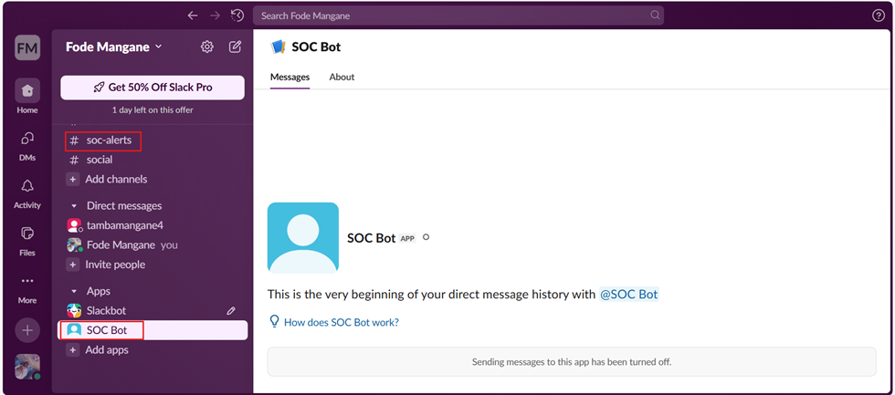

Étape 1 : Création de l'application Slack
   1. Accéder à https://api.slack.com/apps
   2. Cliquer sur Create New App
   3. Sélectionner From scratch
   4. Remplir : 
      App Name : SOC Bot
      Workspace : Sélectionner votre workspace Slack
   5. Puis nous clicons sur notre App

Étape 2 : Configuration des permissions (OAuth Scopes)
  1.	Dans le menu de gauche, aller dans OAuth & Permissions
  2.	Descendre jusqu'à Scopes → Bot Token Scopes
  3.	Cliquer sur Add an OAuth Scope
  4.	Ajouter les permissions suivantes : 
  o	chat:write : Pour envoyer des messages
  o	channels:read : Pour lire les informations des canaux
Étape 3 : Installation du Bot dans le workspace
  1.	Remonter en haut de la page OAuth & Permissions
  2.	Cliquer sur Install to Workspace
  3.	Autoriser les permissions demandées
  4.	COPIER LE TOKEN qui commence par xoxb- (Bot User OAuth Token)

Étape 4 : Création du canal et ajout du bot
1.	Dans votre workspace Slack, créer un nouveau canal : #soc-alerts
2.	Dans le canal, taper /invite @SOC Bot pour ajouter le bot au canal
3.	Le bot doit apparaître dans la liste des membres du canal

